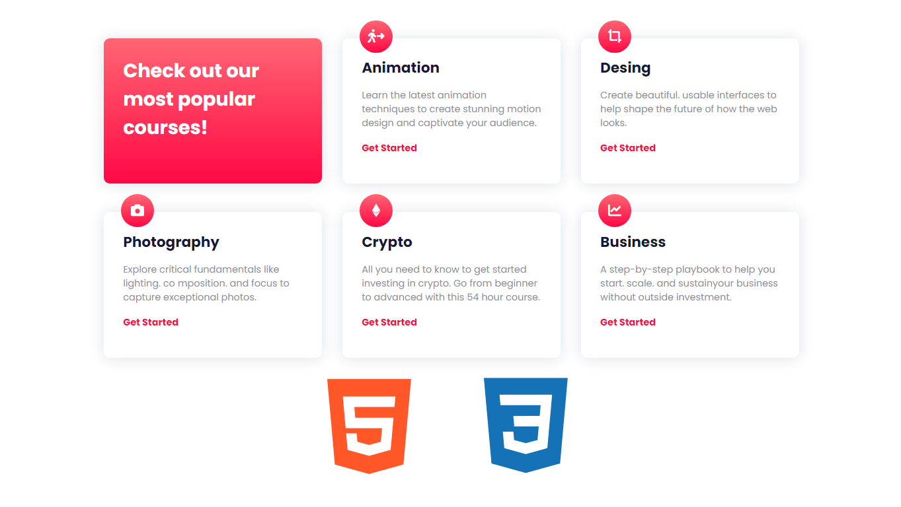

# Cards Grid
¡Hola un saludo a todos! Estoy creando una practica con Html y Css en mi canal de YouTube. En este repositorio hay 2 ramas, la principal donde esta el entorno del sitio y la otra donde esta el sitio completo para que lo puedan analizar.
Por favor no olviden suscribirse a [@MinimalWeb](https://www.youtube.com/@MinimalWeb?sub_confirmation=1)

Mira el video aquí: https://youtu.be/3e9iPSI4HXM

